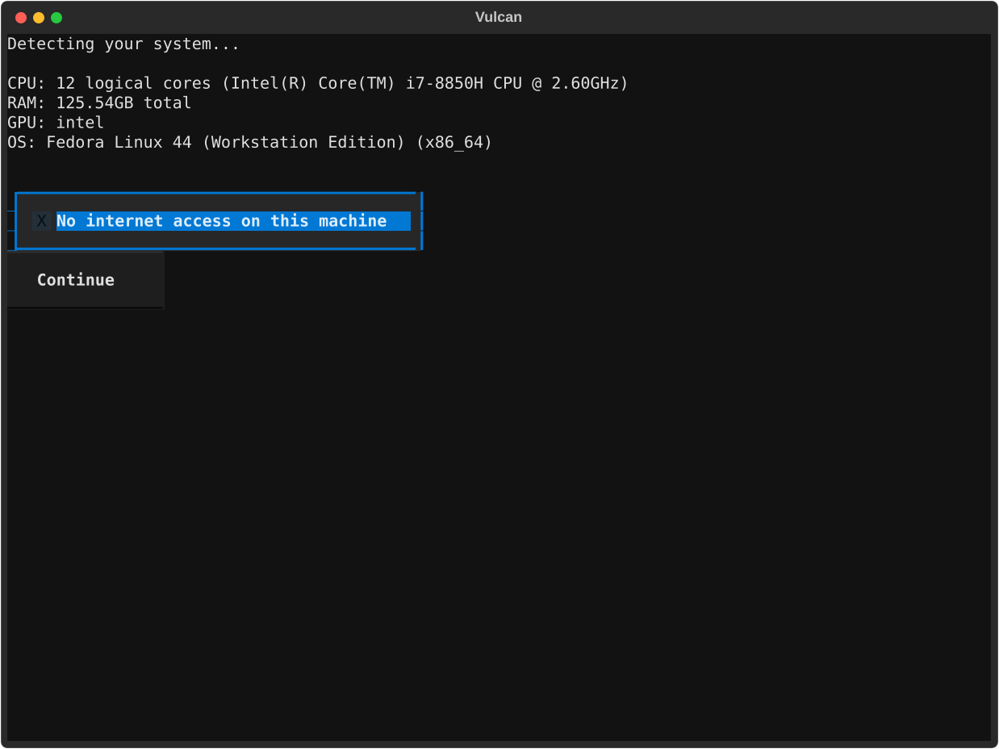
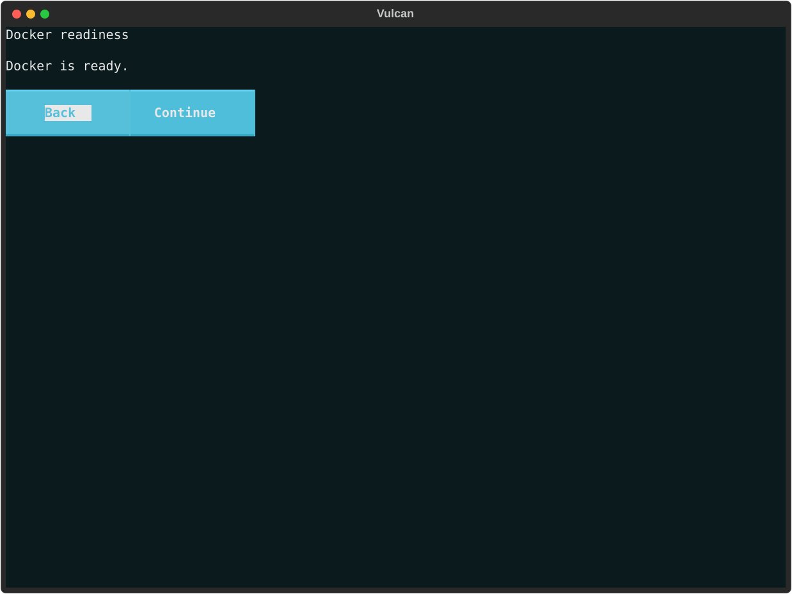
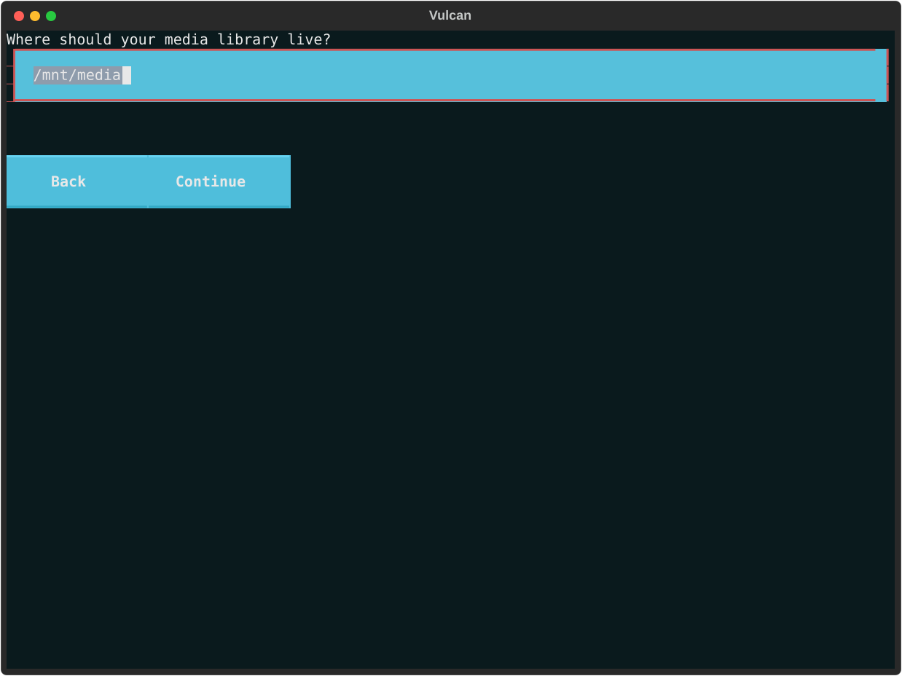
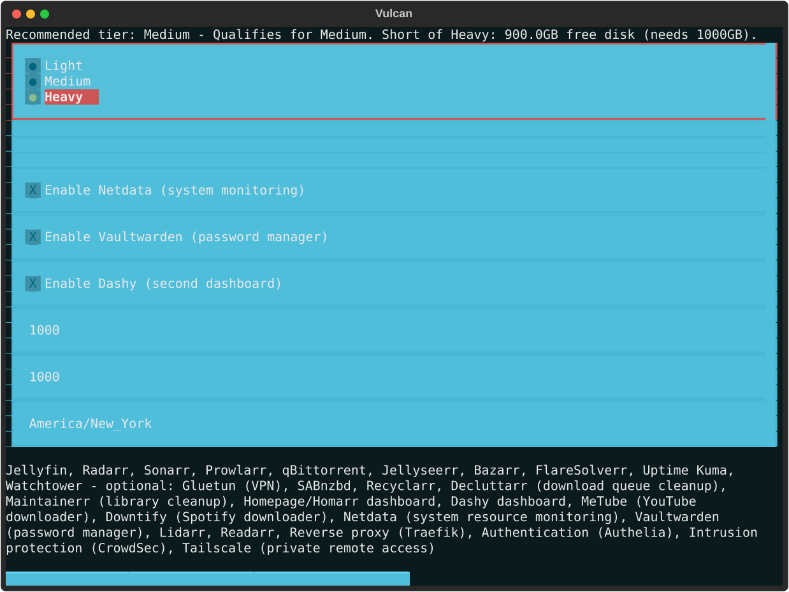
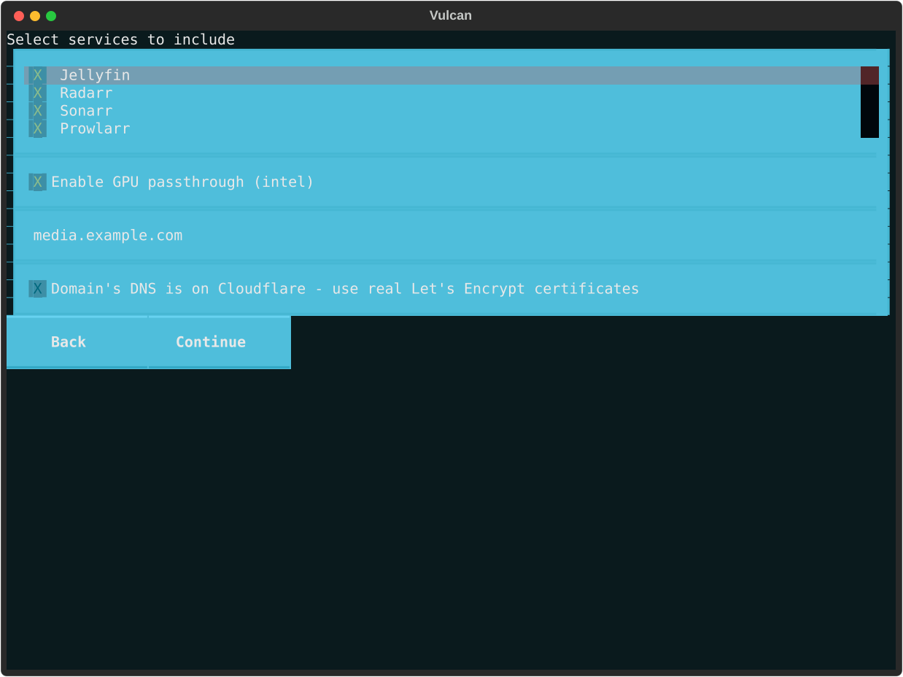
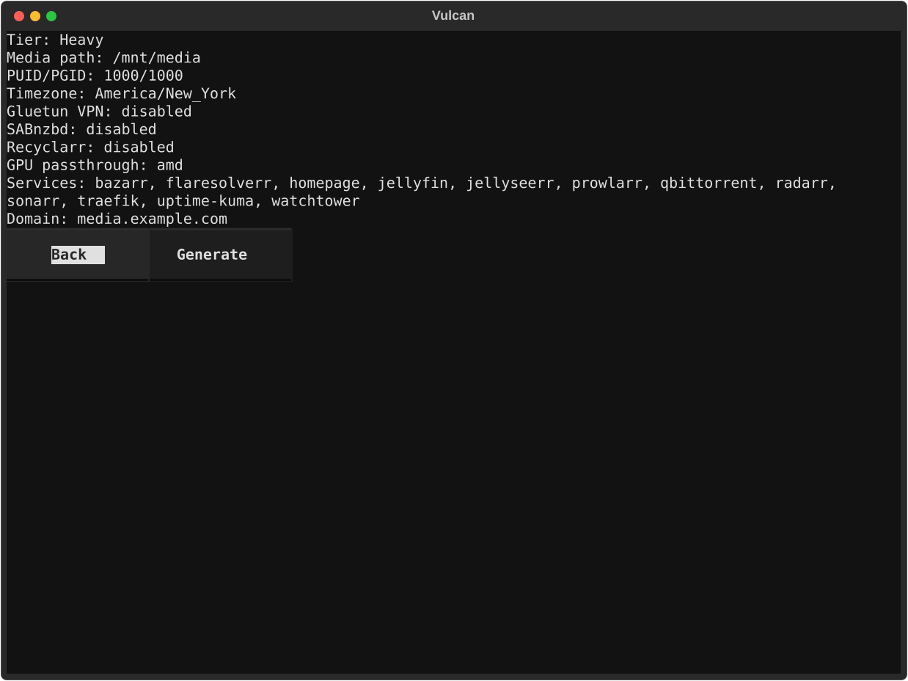

# Vulcan

**An intelligent media stack forge.**

Vulcan inspects your system's resources and automatically builds a tailored Jellyfin + *arr homelab — sized as Light, Medium, or Heavy to match what your machine can actually handle. Point it at a Linux box, answer a handful of questions, and get back a working `docker-compose.yml` and `.env` scoped to your real hardware, not a one-size-fits-all stack that either starves a small machine or wastes a big one.

Tier decisions are deterministic — fixed rules based on detected CPU/RAM/disk/GPU, no LLM involved.

*Pre-alpha, actively developed. Every feature below has been verified against real infrastructure as it was built, not just exercised in isolation — see [CONTRIBUTING.md](CONTRIBUTING.md) for what's genuinely finished versus still open.*

---

## Features

- **Hardware-aware sizing** — Light, Medium, or Heavy, picked from real detected CPU, RAM, disk, and GPU, with hardware transcoding wired in automatically when a GPU is found.
- **Guided TUI or scriptable CLI** — a full guided setup by default, a plain-prompt fallback (`--plain`), and a fully non-interactive path (`--non-interactive`) for automation.
- **Custom mode** — free-pick any of Vulcan's 17 known services regardless of tier, pre-checked from what your hardware qualifies for.
- **Real domain-based routing** — optional Traefik integration with automatic HTTPS (self-signed by default), no manual reverse-proxy config.
- **Pre-seeded dashboard** — Homepage boots with real tiles for your actual stack instead of a blank page.
- **Re-run safe** — regenerating an existing stack never resets a real credential (like a Gluetun VPN key) back to a placeholder.
- **Full lifecycle, not just first install** — `vulcan update`/`pull`/`backup`/`restore` round out an already-generated stack.
- **Airgap-friendly** — `--offline` skips the automatic Docker install attempt when there's no connection, and `vulcan export`/`import` move a stack's images to a machine that never touches the network.
- **Storage-aware** — reports whether your media path actually has any drive-level redundancy (mdadm/btrfs/ZFS), and warns if a single drive failure would mean data loss. Read-only: Vulcan never creates or modifies storage itself.

## Screenshots

The guided TUI (`./install`'s default), screen by screen:

| | |
|---|---|
|  System detection |  Docker readiness |
|  Media library path |  Tier & configuration |
|  Custom service selection |  Review & generate |

---

## Requirements

- Linux (Ubuntu, Debian, Raspbian, Fedora, and Arch all have an automatic Docker install path; other distros need Docker installed manually first)
- Python 3.11+
- Docker — installed and started automatically on supported distros if it isn't already there

## Quick Start

```bash
git clone https://github.com/Cyb3rRon1n/vulcan.git
cd vulcan
./install
```

`./install` bootstraps a local virtual environment on first run, then walks you through a guided flow: detects your system, gets Docker ready if it isn't already, recommends a tier, asks only the questions that matter (media path, optional VPN/SABnzbd/Recyclarr, PUID/PGID/timezone), and generates a ready-to-run stack — with the option to start it immediately. Before actually starting, Vulcan checks that every port your stack needs is genuinely free and refuses cleanly (naming the conflicting port) rather than letting Docker fail partway through. Once it's up, Vulcan prints the real URL for every service you enabled, so you're not left guessing ports.

Non-interactive / scripted use is also supported:

```bash
./install --tier medium --media-path /mnt/media --non-interactive --yes --start
```

`--non-interactive` requires both `--yes` and an explicit `--tier`/`--media-path` — nothing is inferred silently in scripted mode. `--start` is likewise opt-in on every path: generating a stack never launches it without being asked (interactively) or told to (`--start`). Prefer the original plain-prompt flow over the TUI (e.g. on a limited terminal)? Add `--plain`.

---

## Tiers

| Tier | Target Hardware | Core Services | Extras |
|---|---|---|---|
| Light | ≥ 2 cores, ≥ 4 GB RAM, ≥ 100 GB free | Jellyfin, Radarr, Sonarr, Prowlarr, qBittorrent | Optional SABnzbd (Usenet), Recyclarr (TRaSH sync) |
| Medium | ≥ 4 cores, ≥ 8 GB RAM, ≥ 500 GB free | Light + Jellyseerr, Bazarr, FlareSolverr | Optional Gluetun (VPN) |
| Heavy | ≥ 6–8 cores, ≥ 16 GB RAM, ≥ 1 TB free | Medium + Homepage, Uptime Kuma, Watchtower | GPU transcoding if detected; Lidarr, Readarr, and Traefik via custom mode |

All tiers share the same directory layout and volume naming, so re-running the installer later to move up a tier shouldn't lose data.

**Custom mode** lets you pick exactly which services to include, from all 17 known services regardless of tier, pre-checked based on what your hardware qualifies for:

```bash
./install --plain --tier medium --services jellyfin,radarr,homepage,watchtower --non-interactive --yes --media-path /mnt/media
```

Resource limits still scale using whichever tier you choose (`--tier` here, or the detected recommendation if omitted) — picking Homepage or Watchtower alongside a Medium selection doesn't pull in Heavy-tier resource limits. In the interactive `--plain` flow, answer "y" to "Customize which services are included?" after picking a tier. In the default TUI, click "Customize Services" on the tier screen instead of "Continue" to get the same free-pick checklist.

**Domain-based routing.** If `traefik` is part of your custom selection, pass `--domain` to get real `<service>.<domain>` routing (e.g. `jellyfin.media.example.com`) for every included web-facing service, instead of Traefik's default do-nothing skeleton:

```bash
./install --plain --tier heavy --services jellyfin,radarr,sonarr,traefik --domain media.example.com --non-interactive --yes --media-path /mnt/media
```

HTTPS uses Traefik's own auto-generated self-signed certificate by default — real routing and encryption with zero external setup, at the cost of a browser trust warning on first visit. Vulcan doesn't create DNS records or configure Let's Encrypt/ACME for you; point each subdomain at this host yourself. qBittorrent isn't routed when Gluetun is also enabled, since it shares Gluetun's network namespace in a way Traefik can't discover.

**Pre-seeded dashboard.** If Homepage is included, it boots with real tiles for every other web-facing service already in your stack — correct icon, correct link (routed through Traefik if you've set up domain-based routing, otherwise your host's real LAN address) — instead of a blank dashboard you'd have to configure by hand. Only written once: if you've since customized `stack/config/homepage/services.yaml` yourself, a later regenerate never touches it.

---

## Maintaining an existing stack

```bash
vulcan update              # pull the latest images and recreate containers
vulcan pull                # pull images without starting anything
vulcan backup              # archive stack/config/ + docker-compose.yml/.env to backups/
vulcan restore [file]      # restore config/, docker-compose.yml, and .env from a backup archive
```

`vulcan update` is the on-demand alternative to Heavy tier's Watchtower (which updates continuously on its own) — useful for every other tier, for a cron job, or to force an update right now instead of waiting for the next poll. It confirms before touching anything running (`--non-interactive --yes` for scripted use). `vulcan pull` is `vulcan update`'s pull step on its own, with nothing recreated or restarted — run it (or click "Pull Images Now" at the end of the guided TUI flow) while you have a connection to prepare a stack you'll start later somewhere offline; needs no confirmation, since it touches nothing running. `vulcan backup` needs no confirmation either — it only ever adds a new timestamped archive under `backups/` (gitignored, like `stack/`), and it's safe to run while your stack is up: any live SQLite database (Radarr/Sonarr/Jellyfin/etc.) is snapshotted consistently rather than archived mid-write. The archive includes `stack/.env`, which may hold real credentials, so store it securely. `vulcan restore` reverses a backup: it defaults to the most recent archive in `backups/` if you don't pass a specific file, stops the currently running stack first (if there is one) so extraction can't race with a container actively using its own config directory, then extracts over what's there now — genuinely destructive, so it confirms before touching anything, same as every other mutating command.

---

## Airgap / offline installs

Vulcan assumes internet access by default, but two real gaps are covered:

```bash
./install --offline            # or check "No internet access" in the guided TUI
vulcan export [--output PATH]  # bundle already-pulled images into a tarball (exports/)
vulcan import [FILE]           # load images from that tarball on another machine
```

`--offline` (CLI flag or the checkbox on the guided TUI's first screen) tells Vulcan not to attempt an automatic Docker install if Docker isn't found — installing it needs a connection Vulcan won't assume you have, so you'll get a link to the manual install docs instead. Docker being installed some other way ahead of time is unaffected either way. `vulcan export` packages a stack's already-pulled images (run `vulcan pull` first) into a single tarball under `exports/`; `vulcan import` loads that tarball's images on a different machine — one that's never been online at all, unlike `vulcan pull`, which still needs a live connection on the same machine it's run on. Neither needs confirmation, and `import` defaults to the most recent file in `exports/` if you don't pass one, the same convenience `restore` already offers for backups.

---

## Design Principles

- **Deterministic, not AI-driven.** Tier recommendations come from fixed rules over detected hardware — no LLM in the decision path.
- **Observe, then act.** The installer shows you what it detected and what it's about to generate before doing anything; nothing is silently overwritten.
- **Re-run safe.** Running the installer again against an existing stack should offer to upgrade/reconfigure, not clobber it.
- **Secrets stay out of git.** Generated `.env` files are never committed; `.gitignore` excludes the whole `stack/` output directory.

---

## Contributing

Contributions are welcome — see [CONTRIBUTING.md](CONTRIBUTING.md) for the project's philosophy, development setup, and coding standards. [CLAUDE.md](CLAUDE.md) covers the real architecture in depth.

---

## License

Vulcan is released under the [MIT License](LICENSE).
