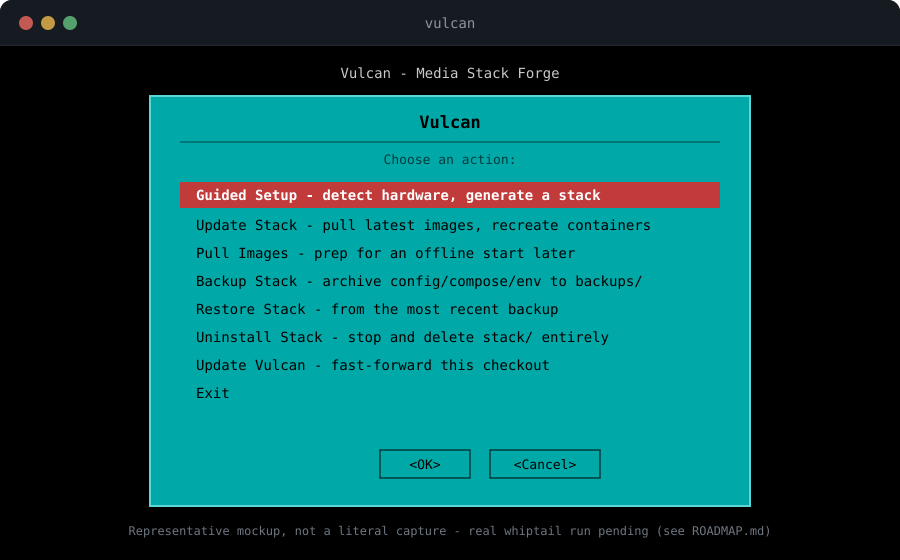

# Vulcan

<p align="center">
  <a href="https://github.com/Cyb3rRon1n/vulcan/actions/workflows/ci.yml">
    
  </a>
  <a href="LICENSE"></a>
  
</p>

<p align="center">
  <a href="https://github.com/Cyb3rRon1n/vulcan/actions/workflows/ci.yml">
    
  </a>
</p>

<p align="center">
  📖 <a href="https://cyb3rron1n.github.io/vulcan/">Documentation</a> · <a href="docs/getting-started/index.md">Getting Started</a> · <a href="ROADMAP.md">Roadmap</a> · <a href="docs/walkthrough.md">Walkthrough</a> · <a href="docs/guides/homepage-widgets.md">Dashboard Widgets Guide</a> · <a href="https://cyb3rron1n.github.io/">Sibling Projects</a> · <a href="docs/images/favicon.svg">Favicon</a>
</p>

**Deploy a self-hosted media homelab, sized to your hardware.** Vulcan inspects your Linux host's real hardware and generates a Docker Compose media stack — Light, Medium, or Heavy — sized to what your machine can actually handle. Deterministic tier recommendations from detected CPU, RAM, disk, and GPU. No LLM in the decision path.

**Sudo required:** run `./install` as a non-root user with `sudo` available. Before anything else it runs one **Phase 0** pass — installs `git`, `python3-venv`, `whiptail`, `mdadm`, and Docker Engine + `docker compose` on Ubuntu/Debian/Fedora/Arch, adds you to the `docker` group — and escalates to root **once** (prints a heads-up block, then `sudo`) if it needs to. On other distros it prints what to install by hand. `vulcan preflight [--fix]` runs Phase 0 on its own.

---

## Quick Start

```bash
git clone https://github.com/Cyb3rRon1n/vulcan.git
cd vulcan
./install
```

`./install` runs Phase 0 (system packages + Docker, one `sudo` escalation — see above), bootstraps a local virtual environment, then opens a persistent **Main Menu** — Guided Setup (whiptail-driven), plus Update/Pull/Backup/Restore/Uninstall for an already-generated stack. Every item is always listed; picking a task before a stack exists gives a real "no stack found" message. **Guided Setup** runs an explicit sequence:

1. **Preflight** — re-check Phase 0
2. **Detect** hardware
3. **Recommend** a tier
4. **Shape** — pick the tier and services (media path, optional extras — VPN, a Usenet client, an automated quality-profile sync, a dashboard — PUID/PGID/timezone)
5. **Confirm** what's about to be generated
6. **Build** (`vulcan build`) — writes `stack/docker-compose.yml` + `.env` and starts nothing; works even with Docker down
7. **Configure** (`vulcan configure`) — prompts for the credentials whatever you enabled actually needs (a VPN key, a tunnel token, a mesh-VPN auth key, a DNS admin password — only ever asked about services you turned on) and writes them into `stack/.env`
8. **Start** (`vulcan start`) — needs Docker; checks every needed port is free and refuses cleanly (naming the conflict), then `docker compose up -d`, then a container-stayed-up check
9. **Report** — the real URL for every service you enabled

Scripted use is also supported:

```bash
./install --tier medium --media-path /mnt/media --non-interactive --yes --start
```

`--non-interactive` requires `--yes` and an explicit `--tier`/`--media-path`. `--start` is opt-in on every path: generating a stack never launches it without being asked or told. Use `--plain` for the plain-prompt flow (no whiptail).

<p align="center">
  <br>
  <sub>The persistent Main Menu (representative mockup, real <code>whiptail</code> theme) — <a href="https://cyb3rron1n.github.io/vulcan/">more in the docs →</a></sub>
</p>

---

## Tiers

Each tier's actual service list is shown before you pick — not just the name. The full, named list lives in the [Services Catalog](docs/services-catalog.md); this table is the shape, not the roster.

| Tier | Target Hardware | Core stack (always on) |
|------|-----------------|---------------|
| Light | ≥ 2 cores, ≥ 4 GB RAM, ≥ 100 GB | a download client, two library-management apps, a shared indexer manager |
| Medium | ≥ 4 cores, ≥ 8 GB RAM, ≥ 500 GB | Light + a request front-end, subtitle management, an indexer CAPTCHA-solver |
| Heavy | ≥ 6–8 cores, ≥ 16 GB RAM, ≥ 1 TB | Medium + uptime monitoring, automatic image updates |

Every tier also offers the same ~25 tier-agnostic optional extras, spanning: a VPN client (on by default), a second download-client type, automated quality-profile sync, download-queue/library cleanup, a dashboard, on-demand media downloaders, system monitoring, a password manager, DNS-level ad blocking, a file manager, and container management. Heavy adds GPU transcoding (when a GPU is detected) plus, via custom mode, more library-management apps, a reverse proxy, a login wall, intrusion protection, a private mesh VPN, a zero-forwarded-ports tunnel, and live-TV/sports automation. **Full named list, one row per service, by category: [Services Catalog](docs/services-catalog.md).**

All tiers share the same directory layout and volume naming, so re-running later to move up a tier shouldn't lose data.

### Custom mode

Pick exactly which of the 36 known services to include, regardless of tier, pre-checked based on your hardware — service keys come from the [Services Catalog](docs/services-catalog.md):

```bash
sudo ./install --plain --tier medium --services <comma-separated-service-keys> --non-interactive --yes --media-path /mnt/media
```

Resource limits scale using whichever tier you choose, independent of which extras you add. In `--plain`, answer "y" to "Customize which services are included?" after picking a tier. In the whiptail menu, answer "Yes" to "Customize the full service list?" right after picking a tier. This is also the only path that can reach the reverse-proxy/login-wall/intrusion-protection/mesh-VPN/queue-and-library-cleanup extras and the two Heavy-only library apps, since domain-based routing only activates when an explicit service list includes the reverse proxy.

---

## Optional Integrations

Beyond the core stack, custom mode unlocks real infrastructure most homelab installers skip: domain-based routing with automatic HTTPS, a real-certificate path via a DNS provider, a zero-forwarded-ports tunnel, a private mesh VPN, a login wall in front of every routed service, edge-level bad-IP blocking, DNS-level ad blocking (two interchangeable options), and per-metric monitoring widgets — plus pre-seeded dashboards, queue/library automation, and on-demand downloaders.

Dashboard tiles come pre-seeded with real links on first build and are never overwritten after that — customize tabs, layout, and widgets by editing plain YAML, easiest done in-browser via the built-in file manager (mounted automatically alongside a dashboard) rather than SSH. See the [Dashboard Widgets Guide](docs/guides/homepage-widgets.md).

Full detail, gotchas, and copy-pasteable commands for each: [Optional Integrations →](https://cyb3rron1n.github.io/vulcan/integrations/) (or [docs/integrations.md](docs/integrations.md)). Named list of every integration: [Services Catalog](docs/services-catalog.md).

---

## Storage Planning & RAID

For a fresh machine with drives that aren't set up yet, Vulcan can detect what's really there and compute the exact `mdadm`/`mkfs`/`mount` commands a RAID + mount setup would need — **plan-only, nothing is ever executed**:

```bash
vulcan storage report                                    # list real block devices, flag which are protected
vulcan storage plan --devices /dev/sdb,/dev/sdc           # compute a plan (mdadm RAID + format + mount)
```

A device backing `/`/`/boot`/`/boot/efi` can never be selected as a target — no override flag. **Software RAID (mdadm) is the recommended approach for homelab media stacks** — it provides redundancy (RAID1/5/10) while keeping all drives in a single filesystem pool, enabling the hardlink-safe volume layout that `write_stack()` relies on (downloads and media on the same filesystem = instant hardlinks, not copies). ZFS and btrfs are also supported for advanced users, but mdadm is the default since it's available in every distro's repos.

**Device safety rule:** A physical device backing `/`, `/boot`, or `/boot/efi` can never be selected as a target — no override flag exists. Full detail: [Storage Planning →](https://cyb3rron1n.github.io/vulcan/storage/) (or [docs/storage.md](docs/storage.md)).

---

## Maintaining an Existing Stack

Commands reachable from the Main Menu (not CLI-only):

| Command | What it does |
|---|---|
| `sudo vulcan update` | Pulls latest images and recreates containers |
| `sudo vulcan pull` | Pulls images without starting anything |
| `sudo vulcan backup` | Archives `stack/config/` + `docker-compose.yml`/`.env` to `backups/` |
| `sudo vulcan restore [file]` | Restores `config/`, `docker-compose.yml`, and `.env` from a backup |
| `sudo vulcan uninstall` | Stops the stack and deletes `stack/` entirely — back to a clean slate |
| `sudo vulcan update-self` | Updates this Vulcan checkout — plain fast-forward `git pull` |
| `vulcan plan export [file]` | Writes the current stack's shape (tier, services, settings — no credentials) to a shareable JSON file |
| `vulcan build --from-plan <file>` | Builds a new stack from an exported plan, on this machine or another — every other flag still overrides the plan's value for that field |

Airgap/offline: `--offline` skips the Docker install attempt; `vulcan export`/`import` move a stack's images to a machine never online at all, and `vulcan export-bundle`/`install-bundle` (or `./install --bundle FILE`) carry Vulcan's own Python deps for a zero-network first boot.

Full detail, destructive vs. safe, and airgap installs: [Maintaining a Stack →](https://cyb3rron1n.github.io/vulcan/maintenance/) (or [docs/maintenance.md](docs/maintenance.md)).

---

## License

Vulcan is released under the [MIT License](LICENSE).
