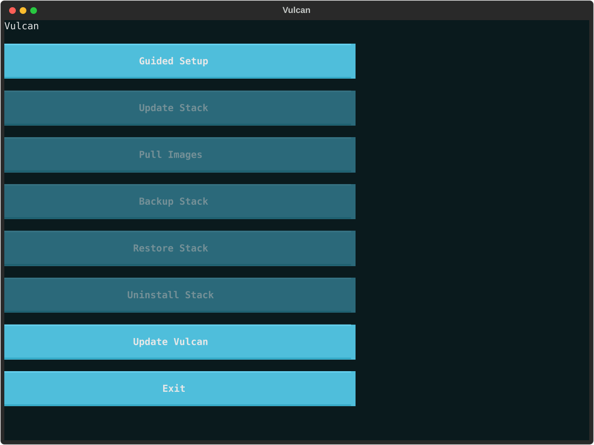

# Vulcan

<p align="center">
  <a href="https://github.com/Cyb3rRon1n/vulcan/actions/workflows/ci.yml"></a>
  <a href="LICENSE"></a>
  
</p>

<p align="center"><strong>An intelligent media stack forge.</strong></p>

Vulcan inspects your Linux host's real hardware, recommends a sized tier (Light / Medium / Heavy), and generates a ready-to-run Jellyfin + `*arr` Docker Compose media stack — scoped to what your machine can actually handle, not a one-size-fits-all stack that either starves a small machine or wastes a big one. Tier decisions are deterministic, fixed rules over detected CPU/RAM/disk/GPU — no LLM in the decision path.

- **Who it's for** — Homelab and self-hosted folks who want a media server + download automation stack without hand-tuning resource limits or manually wiring a dozen services together.
- **Where it runs** — Any Linux host with Docker (Ubuntu, Debian, Raspbian, Fedora, and Arch all get an automatic Docker install) and Python 3.11+.
- **Where it's at** — Actively developed, with every feature verified against real infrastructure (real Docker, real containers, real hardware where available) as it was built, not just exercised in isolation. Real ARM64 hardware is the one open verification gap — see [ROADMAP.md](ROADMAP.md) for what's genuinely finished versus still open.

---

## Contents

- [Screenshots](#screenshots)
- [Features](#features)
- [Requirements](#requirements)
- [Quick Start](#quick-start)
- [Tiers](#tiers)
- [Optional Integrations](#optional-integrations)
- [Maintaining an Existing Stack](#maintaining-an-existing-stack)
- [Airgap / Offline Installs](#airgap--offline-installs)
- [Design Principles](#design-principles)
- [Contributing](#contributing)
- [License](#license)

---

## Screenshots

`./install` opens on a persistent Main Menu, screen by screen from there:

<p align="center">
  <br>
  <sub><b>1. Main Menu</b> — Guided Setup plus every lifecycle command (update/pull/backup/restore/uninstall), gated on whether a stack or backup actually exists</sub>
</p>

<p align="center">
  <br>
  <sub><b>2. System detection</b> (Guided Setup) — real CPU, RAM, disk, and GPU read off the host</sub>
</p>

<p align="center">
  <br>
  <sub><b>3. Docker readiness</b> — installs and starts Docker automatically if it isn't already there</sub>
</p>

<p align="center">
  <br>
  <sub><b>4. Media library path</b> — checks real free space against tier thresholds</sub>
</p>

<p align="center">
  <br>
  <sub><b>5. Tier & configuration</b> — shows what each tier actually contains before you pick one</sub>
</p>

<p align="center">
  <br>
  <sub><b>6. Custom service selection</b> — free-pick any of the 27 known services</sub>
</p>

<p align="center">
  <br>
  <sub><b>7. Review & generate</b> — writes the stack, with the option to start it immediately</sub>
</p>

---

## Features

**Core**

- **Hardware-aware sizing** — Light, Medium, or Heavy, picked from real detected CPU, RAM, disk, and GPU, with hardware transcoding wired in automatically when a GPU is found.
- **Guided TUI or scriptable CLI** — a full guided setup by default, a plain-prompt fallback (`--plain`), and a fully non-interactive path (`--non-interactive`) for automation.
- **Persistent Main Menu** — the TUI opens on a real hub (Guided Setup plus every lifecycle command below), not straight into detection. Pick a maintenance task, finish it, and land back on the menu to pick another, rather than the app just exiting.
- **Custom mode** — free-pick any of Vulcan's 27 known services regardless of tier, pre-checked from what your hardware qualifies for.
- **Re-run safe** — regenerating an existing stack never resets a real credential (like a Gluetun VPN key) back to a placeholder.
- **Full lifecycle, not just first install** — `vulcan update`/`pull`/`backup`/`restore`/`uninstall` round out an already-generated stack.
- **Airgap-friendly** — `--offline` skips the automatic Docker install attempt when there's no connection, and `vulcan export`/`import` move a stack's images to a machine that never touches the network.
- **Storage-aware** — reports whether your media path actually has any drive-level redundancy (mdadm/btrfs/ZFS), and warns if a single drive failure would mean data loss. Read-only: Vulcan never creates or modifies storage itself.

**Networking & security**

- **Real domain-based routing** — optional Traefik integration with automatic HTTPS (self-signed by default, or real Let's Encrypt certificates if your domain's DNS is on Cloudflare), no manual reverse-proxy config.
- **Real login, not just routing** — optional Authelia integration puts a real username/password in front of every routed service, no external identity provider or database required.
- **Intrusion protection** — optional CrowdSec watches Traefik's own access log and blocks IPs its community blocklist flags as malicious, on every routed service (including the two that skip Authelia) — protects the door, not just the login page behind it.
- **Password manager** — optional Vaultwarden (a lightweight, Bitwarden-compatible server) for every credential this stack generates, with the official Bitwarden apps working against it unmodified.
- **Private remote access** — optional Tailscale integration puts every host-published port in your stack on your own tailnet, reachable from anywhere with no port-forwarding and no public exposure at all.

**Media automation**

- **Automated queue and library cleanup** — optional Decluttarr removes stalled or failed downloads from Radarr/Sonarr's queue and triggers a fresh search, and optional Maintainerr cleans up unwatched media on your media server's own rules — complementary, not overlapping.
- **Automated downloaders** — optional MeTube (video) and Downtify (Spotify-sourced audio, no Premium account needed) for on-demand grabs outside the `*arr` automation pipeline.

**Dashboards & monitoring**

- **Pre-seeded dashboard, two options** — optional Homepage or Dashy, available at every tier, both boot with real, grouped, described tiles for your actual stack instead of a blank page.
- **Real-time system monitoring** — optional Netdata for live CPU/RAM/disk/network/temperature and per-container awareness, matched to its own official recommended configuration.

---

## Requirements

- Linux (Ubuntu, Debian, Raspbian, Fedora, and Arch all have an automatic Docker install path; other distros need Docker installed manually first)
- Python 3.11+
- Docker — installed and started automatically on supported distros if it isn't already there

## Quick Start

```bash
git clone https://github.com/Cyb3rRon1n/vulcan.git
cd vulcan
./install
```

`./install` bootstraps a local virtual environment on first run, then opens on a persistent **Main Menu** — Guided Setup, plus Update/Pull/Backup/Restore/Uninstall for a stack you've already generated (each gated off until there's actually a stack or backup to act on). Picking **Guided Setup** walks you through:

1. Detects your system
2. Gets Docker ready if it isn't already
3. Recommends a tier
4. Asks only the questions that matter (media path, optional VPN/SABnzbd/Recyclarr/Homepage, PUID/PGID/timezone)
5. Generates a ready-to-run stack, with the option to start it immediately

Before actually starting, Vulcan checks that every port your stack needs is genuinely free and refuses cleanly (naming the conflicting port) rather than letting Docker fail partway through. Once it's up, Vulcan prints the real URL for every service you enabled, so you're not left guessing ports.

Non-interactive / scripted use is also supported:

```bash
./install --tier medium --media-path /mnt/media --non-interactive --yes --start
```

`--non-interactive` requires both `--yes` and an explicit `--tier`/`--media-path` — nothing is inferred silently in scripted mode. `--start` is likewise opt-in on every path: generating a stack never launches it without being asked (interactively) or told to (`--start`). Prefer the original plain-prompt flow over the TUI (e.g. on a limited terminal)? Add `--plain`.

---

## Tiers

Both the guided TUI and the plain CLI show what each tier actually contains before you pick one — not just its name.

| Tier | Target Hardware | Core Services |
|---|---|---|
| Light | ≥ 2 cores, ≥ 4 GB RAM, ≥ 100 GB free | Jellyfin, Radarr, Sonarr, Prowlarr, qBittorrent |
| Medium | ≥ 4 cores, ≥ 8 GB RAM, ≥ 500 GB free | Light + Jellyseerr, Bazarr, FlareSolverr |
| Heavy | ≥ 6–8 cores, ≥ 16 GB RAM, ≥ 1 TB free | Medium + Uptime Kuma, Watchtower |

Every tier also offers the same tier-agnostic optional extras: Gluetun (VPN, on by default), SABnzbd (Usenet), Recyclarr (TRaSH sync), Decluttarr (queue cleanup), Maintainerr (library cleanup), Homepage or Dashy (dashboard), MeTube/Downtify (downloaders), Netdata (monitoring), and Vaultwarden (password manager). Heavy tier adds GPU transcoding when a GPU is detected, plus Lidarr, Readarr, Traefik, Authelia, CrowdSec, and Tailscale via custom mode.

All tiers share the same directory layout and volume naming, so re-running the installer later to move up a tier shouldn't lose data.

### Custom mode

Pick exactly which services to include, from all 27 known services regardless of tier, pre-checked based on what your hardware qualifies for:

```bash
./install --plain --tier medium --services jellyfin,radarr,homepage,watchtower --non-interactive --yes --media-path /mnt/media
```

Resource limits still scale using whichever tier you choose (`--tier` here, or the detected recommendation if omitted) — picking Homepage or Watchtower alongside a Medium selection doesn't pull in Heavy-tier resource limits. In the interactive `--plain` flow, answer "y" to "Customize which services are included?" after picking a tier. In the default TUI, click "Customize Services" on the tier screen instead of "Continue" to get the same free-pick checklist.

---

## Optional Integrations

### Domain-based routing (Traefik)

If `traefik` is part of your custom selection, pass `--domain` to get real `<service>.<domain>` routing (e.g. `jellyfin.media.example.com`) for every included web-facing service, instead of Traefik's default do-nothing skeleton:

```bash
./install --plain --tier heavy --services jellyfin,radarr,sonarr,traefik --domain media.example.com --non-interactive --yes --media-path /mnt/media
```

HTTPS uses Traefik's own auto-generated self-signed certificate by default — real routing and encryption with zero external setup, at the cost of a browser trust warning on first visit. Vulcan doesn't create DNS records for you; point each subdomain at this host yourself. qBittorrent isn't routed when Gluetun is also enabled, since it shares Gluetun's network namespace in a way Traefik can't discover. Traefik's own routing dashboard is also enabled at `https://traefik.<domain>` — protected by Authelia automatically if it's also active, otherwise Vulcan warns that it's reachable with no login in front of it.

### Real Let's Encrypt certificates via Cloudflare DNS

If your domain's DNS is managed by Cloudflare, add `--cloudflare-dns` (with `--cloudflare-email`) to get real, trusted certificates instead of Traefik's self-signed default — no browser warning, no port-forwarding required (DNS-01 challenges don't need one):

```bash
./install --plain --tier heavy --services jellyfin,radarr,sonarr,traefik --domain media.example.com --cloudflare-dns --cloudflare-email you@example.com --non-interactive --yes --media-path /mnt/media
```

You'll need a scoped Cloudflare API token (`Zone:DNS:Edit` on your domain's zone) filled into `stack/.env` (`CF_DNS_API_TOKEN`) before this actually issues anything — Vulcan reminds you after generating, the same "never invent a secret, always tell you what's needed" pattern every other credential in this project follows.

### Private remote access (Tailscale)

Add `tailscale` to your custom selection for access to every host-published port in your stack from anywhere, with zero public exposure and no port-forwarding — a real alternative to Traefik+domain routing when you'd rather not expose anything to the public internet at all, or a complement to it for services you'd rather keep private. Needs a real auth key (`TS_AUTHKEY` in `stack/.env`, generated at [login.tailscale.com/admin/settings/keys](https://login.tailscale.com/admin/settings/keys)) before it connects. Runs with host networking, so once it's authenticated, every service's existing host-published port (Jellyfin at `:8096`, Radarr at `:7878`, etc.) is reachable from any device on your tailnet at this host's Tailscale address — no per-service setup needed.

### Auth (Authelia)

Add `authelia` alongside `traefik` in a custom selection to put a real login in front of every routed service — no LDAP, Postgres, or Redis required, and no external identity provider. You'll be prompted for an admin username/password (once — a regenerate never re-asks if it's already configured), and Vulcan handles hashing it and generating the random secrets Authelia needs itself. Without Traefik+`--domain` also active, Authelia has nothing to protect and its own login portal isn't reachable — Vulcan warns outright rather than pretending it did something.

### Intrusion protection (CrowdSec)

Add `crowdsec` alongside `traefik` in a custom selection to block malicious IPs at the edge, before they ever reach a login page — Authelia protects the door once someone's inside, CrowdSec protects the door itself. It watches Traefik's own access log and uses [CrowdSec's](https://www.crowdsec.net/) community-sourced blocklist (via the official [Traefik bouncer plugin](https://github.com/maxlerebourg/crowdsec-bouncer-traefik-plugin)) to block requests from IPs with a bad reputation, on every routed service — including Jellyfin and Vaultwarden, which deliberately skip Authelia (their native apps can't complete a browser-redirect login) but aren't exempt from this, since IP-reputation blocking doesn't share that conflict. No credential to fill in: Vulcan generates a real, random shared key between Traefik and CrowdSec itself. Without Traefik+`--domain` also active, there's no routed traffic for it to protect yet.

**A real, known gotcha, not hidden**: Traefik downloads the bouncer plugin from its own plugin catalog on first start — a separate step from CrowdSec's own container, which starts and works independently of it. This has been observed to fail (even for Traefik's own official demo plugin, confirmed by testing it directly) when Traefik's plugin catalog service itself is having problems — check `docker compose logs traefik` for a "Plugins are disabled" error if requests aren't being filtered; this is an external service issue, not something CrowdSec or Vulcan controls.

### Pre-seeded dashboard (Homepage / Dashy)

If Homepage or Dashy is included, it boots with real tiles for every other web-facing service already in your stack — correct icon, correct link (routed through Traefik if you've set up domain-based routing, otherwise your host's real LAN address), grouped by category (Media, Media Management, Downloads, Monitoring, Security, Infrastructure), and a brief one-line description under each tile so a service is identifiable at a glance, not just an icon and a name — instead of a blank dashboard you'd have to configure by hand. Only written once: if you've since customized the dashboard's config yourself, a later regenerate never touches it.

---

## Maintaining an Existing Stack

Every command below is also reachable from the guided TUI's own **Main Menu** (Update Stack / Pull Images / Backup Stack / Restore Stack / Uninstall Stack) — not CLI-only. The TUI versions confirm before running, mirror the same wording as the CLI's own prompts, and gray themselves out until there's actually a stack (or, for Restore, a backup archive) to act on.

| Command | What it does |
|---|---|
| `vulcan update` | Pulls the latest images and recreates containers |
| `vulcan pull` | Pulls images without starting anything |
| `vulcan backup` | Archives `stack/config/` + `docker-compose.yml`/`.env` to `backups/` |
| `vulcan restore [file]` | Restores `config/`, `docker-compose.yml`, and `.env` from a backup archive |
| `vulcan uninstall` | Stops the stack and deletes `stack/` entirely — back to a clean slate |

`vulcan update` is the on-demand alternative to Heavy tier's Watchtower (which updates continuously on its own) — useful for every other tier, for a cron job, or to force an update right now instead of waiting for the next poll. It confirms before touching anything running (`--non-interactive --yes` for scripted use).

`vulcan pull` is `vulcan update`'s pull step on its own, with nothing recreated or restarted — run it (or click "Pull Images Now" at the end of the guided TUI flow) while you have a connection to prepare a stack you'll start later somewhere offline. Needs no confirmation, since it touches nothing running.

`vulcan backup` needs no confirmation either — it only ever adds a new timestamped archive under `backups/` (gitignored, like `stack/`), and it's safe to run while your stack is up: any live SQLite database (Radarr/Sonarr/Jellyfin/etc.) is snapshotted consistently rather than archived mid-write. The archive includes `stack/.env`, which may hold real credentials, so store it securely.

`vulcan restore` reverses a backup: it defaults to the most recent archive in `backups/` if you don't pass a specific file, stops the currently running stack first (if there is one) so extraction can't race with a container actively using its own config directory, then extracts over what's there now — genuinely destructive, so it confirms before touching anything, same as every other mutating command.

`vulcan uninstall` is the reverse of a plain install: it stops the running stack and deletes `stack/` (containers, network, and all app config/data) so you can run `./install` again as if nothing was ever there — handy for testing, or for tearing a stack down for good. It never touches your media library, and leaves `backups/`/`exports/` alone unless you also pass `--purge-artifacts`.

---

## Airgap / Offline Installs

Vulcan assumes internet access by default, but two real gaps are covered:

| Command | What it does |
|---|---|
| `./install --offline` | Skips the automatic Docker install attempt (or check "No internet access" in the guided TUI) |
| `vulcan export [--output PATH]` | Bundles already-pulled images into a tarball (`exports/`) |
| `vulcan import [FILE]` | Loads images from that tarball on another machine |

`--offline` tells Vulcan not to attempt an automatic Docker install if Docker isn't found — installing it needs a connection Vulcan won't assume you have, so you'll get a link to the manual install docs instead. Docker being installed some other way ahead of time is unaffected either way.

`vulcan export` packages a stack's already-pulled images (run `vulcan pull` first) into a single tarball under `exports/`; `vulcan import` loads that tarball's images on a different machine — one that's never been online at all, unlike `vulcan pull`, which still needs a live connection on the same machine it's run on. Neither needs confirmation, and `import` defaults to the most recent file in `exports/` if you don't pass one, the same convenience `restore` already offers for backups.

---

## Design Principles

- **Deterministic, not AI-driven.** Tier recommendations come from fixed rules over detected hardware — no LLM in the decision path.
- **Observe, then act.** The installer shows you what it detected and what it's about to generate before doing anything; nothing is silently overwritten.
- **Re-run safe.** Running the installer again against an existing stack should offer to upgrade/reconfigure, not clobber it.
- **Secrets stay out of git.** Generated `.env` files are never committed; `.gitignore` excludes the whole `stack/` output directory.

---

## Contributing

Contributions are welcome — see [CONTRIBUTING.md](CONTRIBUTING.md) for the project's philosophy, development setup, and coding standards. [CLAUDE.md](CLAUDE.md) covers the real architecture in depth, and [ROADMAP.md](ROADMAP.md) tracks what's shipped versus still open.

---

## License

Vulcan is released under the [MIT License](LICENSE).
