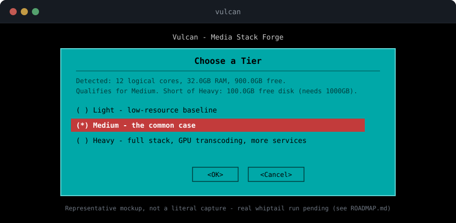
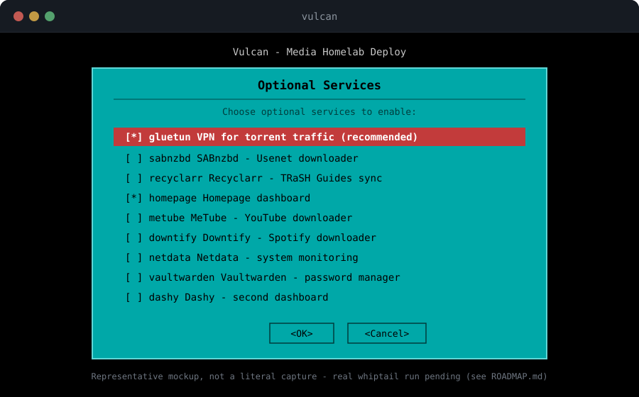

# Vulcan

**Deploy a self-hosted media homelab, sized to your hardware.**

Vulcan inspects your Linux host's real hardware, recommends a sized tier (Light / Medium / Heavy), and generates a ready-to-run, self-hosted media homelab as a Docker Compose stack — scoped to what your machine can actually handle, not a one-size-fits-all stack that either starves a small machine or wastes a big one. Tier decisions are deterministic, fixed rules over detected CPU/RAM/disk/GPU — no LLM in the decision path.

## The 5 W's

- **What** — A hardware-aware installer that detects your machine, recommends a sized self-hosted media homelab stack, and generates it as a ready-to-run Docker Compose project — plus the full lifecycle after that (update, backup, restore, uninstall).
- **Who it's for** — Homelab and self-hosted folks who want a media server + download automation stack without hand-tuning resource limits or manually wiring a dozen services together.
- **When** — Actively developed; changes ship continuously, not on a fixed release cadence. See the [Roadmap](roadmap.md) for what's shipped versus still open.
- **Where it runs** — Any Linux host with Docker (Ubuntu, Debian, Raspbian, Fedora, and Arch all get an automatic Docker install) and Python 3.11+.
- **Why** — Fixed-size, copy-pasted media-stack guides either starve a small machine or waste a big one, and hand-wiring a dozen services together (VPN routing, reverse proxy, auth, dashboards) is real, repetitive, error-prone work. Vulcan replaces both with deterministic, hardware-aware generation — no LLM in the sizing decision, no guesswork in the wiring.

## See it in action

   
  The persistent Main Menu — Guided Setup plus every lifecycle command, real `whiptail`

   
  Guided Setup's tier picker — real detected specs and a real recommendation, before you choose

   
  The optional-services checklist — sensible defaults, freely overridable

!!! note "Representative mockups, not literal captures"
    These are hand-built to match `installer/menu.sh`'s real `NEWT_COLORS` theme and real dialog text — not screenshots. A real interactive `whiptail` terminal run hasn't happened yet (tracked in the [Roadmap](roadmap.md)); these will be replaced with real captures once it has.

## Where to go next

- **New to Vulcan?** Start with [Getting Started](getting-started/index.md).
- **Deciding what to enable?** See [Tiers & Custom Mode](tiers.md) and [Optional Integrations](integrations.md).
- **Setting up fresh storage?** See [Storage Planning](storage.md).
- **Already have a stack running?** See [Maintaining a Stack](maintenance.md).
- **Just generated a stack?** Follow the [Post-Install Walkthrough](walkthrough.md) in the right order.
