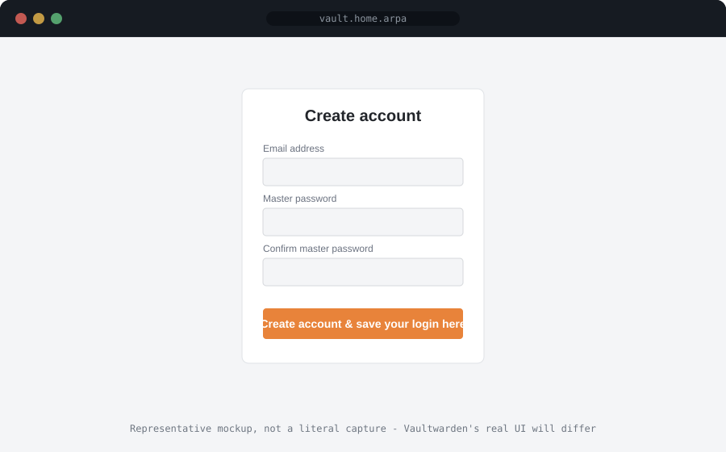
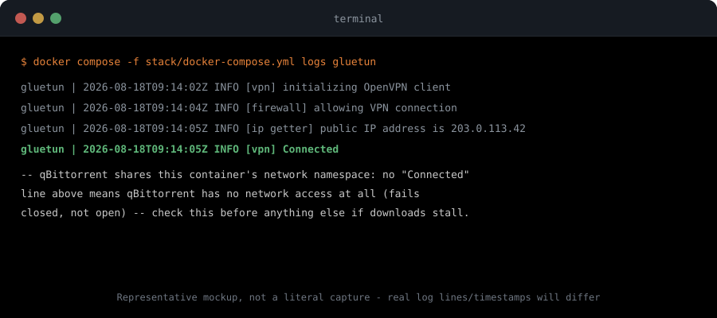
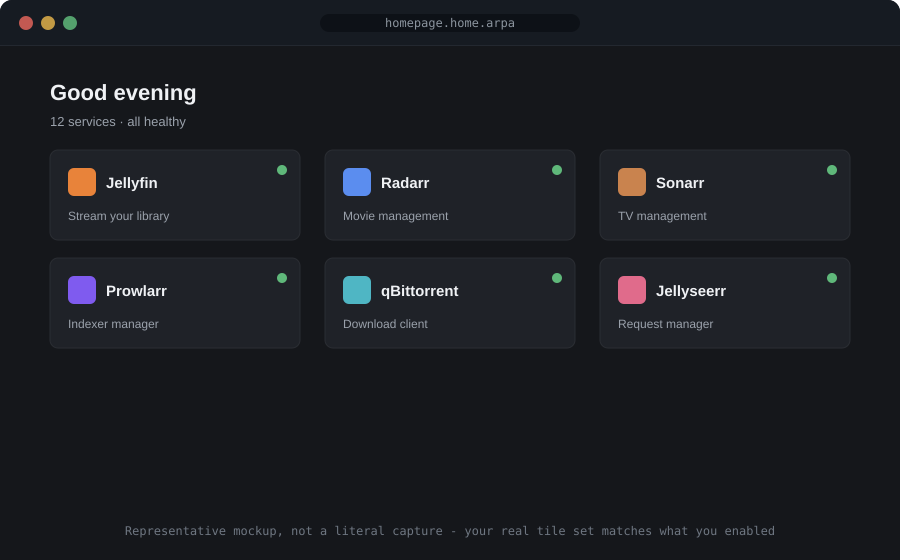

# Post-install walkthrough

Vulcan generates and starts your stack, but every app still needs its own
one-time setup - accounts, API keys, connecting apps to each other. This is
the order to do that in. Later steps depend on earlier ones being done
first, so working top to bottom avoids a lot of "why isn't this working"
detours (e.g. Radarr can't do anything useful until Prowlarr has indexers,
and qBittorrent needs a real login before anything else should touch it).

Skip any section for a service you didn't enable - your guided-menu/CLI run
also printed a copy of this same order, trimmed to just what you actually
enabled, right after the stack came up.

!!! note "Representative mockups, not literal captures"
    The screenshots below are hand-built to show the shape of each screen,
    not pixel-accurate captures of the real apps - the real UI you'll see
    will differ in layout and styling.

## 1. Vaultwarden - do this first

If you enabled it: visit it and create your account before touching
anything else below. Every login, password, and API key you create for the
rest of this walkthrough goes here as you create it - it's much easier to
save each one in the moment than to try to gather them all after the fact.

<p align="center">
  
</p>

**Browser extension** (so it can save/fill credentials as you go through the
rest of this walkthrough) - official store listings, confirmed current via
`bitwarden.com/download`'s own outbound links:

- **Chrome / Brave / Vivaldi**: https://chromewebstore.google.com/detail/bitwarden-free-password-m/nngceckbapebfimnlniiiahkandclblb
- **Firefox**: https://addons.mozilla.org/en-US/firefox/addon/bitwarden-password-manager/
- **Edge**: https://microsoftedge.microsoft.com/addons/detail/jbkfoedolllekgbhcbcoahefnbanhhlh
- **Opera**: https://addons.opera.com/extensions/details/bitwarden-free-password-manager/
- **Safari**: no standalone extension listing - install the Bitwarden desktop app (Mac App Store, or `bitwarden.com/download`), which bundles the Safari extension and lets you enable it from Safari's own Extensions settings

After installing: Settings → gear icon → Self-hosted → set the Server URL to
`http://<your-ip>:8222` **before** logging in, then log in with the account
you just created.

Once you've created every account you need, set `VAULTWARDEN_SIGNUPS_ALLOWED=false`
in `stack/.env` and restart the container to stop accepting new signups.

Vaultwarden is deliberately **not** routed through Authelia even if you
enabled Authelia too - see "A note on Authelia" below for why. Its own
master password (and its own optional two-factor authentication, worth
turning on) is the real protection layer for this one service.

## 2. Authelia

If you enabled it: your admin login was already created during install -
you set the username/password yourself when Vulcan asked. Save that login
in Vaultwarden now.

Authelia protects every other Traefik-routed service in this stack with a
real login and brute-force lockout - you shouldn't need to touch its own
configuration again unless you want to add more user accounts
(`stack/config/authelia/users_database.yml`).

## 3. Prowlarr

If you enabled it: add your indexers first. Radarr, Sonarr, Lidarr, and
Readarr all search *through* Prowlarr, not on their own, so nothing else in
this stack can find anything until this step is done.

Settings > Indexers > Add Indexer, for each tracker/indexer you use.

## 4. Radarr / Sonarr / Lidarr / Readarr

For each one you enabled:

1. Settings > Indexers > Sync with Prowlarr (or add Prowlarr as an
   indexer source directly - Prowlarr's own docs cover both).
2. Settings > Media Management, confirm the root folder points at your
   media library (already mounted correctly by Vulcan, just confirm it).
3. Settings > General, copy the API key - save it in Vaultwarden. You'll
   need it again for Recyclarr, Decluttarr, or Jellyseerr if you enabled
   those.

## 5. qBittorrent / SABnzbd

Set a real login on first visit (not the container image's documented
default) - save it in Vaultwarden. Then connect each *arr app above to it:
Settings > Download Clients > Add.

If Gluetun is enabled, qBittorrent shares its network namespace - the
connection settings work the same either way, just confirm step 6 below is
actually connected first.

SABnzbd additionally needs your Usenet provider's server details entered
through its own setup wizard before it can download anything.

## 6. Gluetun

If you enabled it, `stack/.env` has three placeholder values that need your
real VPN credentials before Gluetun can connect at all -
`VPN_SERVICE_PROVIDER`, `VPN_TYPE` (defaults to `wireguard`), and
`WIREGUARD_PRIVATE_KEY`. A fourth, `WIREGUARD_ADDRESSES`, is only required
by some providers (noted below) - leave it blank otherwise.

These two work with just `WIREGUARD_PRIVATE_KEY` (no `WIREGUARD_ADDRESSES`
needed):

- **ProtonVPN** - `VPN_SERVICE_PROVIDER=protonvpn`. Generate a config at
  [account.proton.me/u/0/vpn/WireGuard](https://account.proton.me/u/0/vpn/WireGuard)
  and copy the `PrivateKey` value shown - it works for all ProtonVPN
  servers, not just the one you generated it for.
- **NordVPN** - `VPN_SERVICE_PROVIDER=nordvpn`. Get your WireGuard private
  key from [my.nordaccount.com](https://my.nordaccount.com/dashboard/nordvpn/manual-configuration/service-credentials/)
  (NordVPN's manual/service credentials, not your regular account
  login).

These two also need `WIREGUARD_ADDRESSES` set (the IPv4 address from your
generated config's `Address` line, e.g. `10.64.222.21/32`):

- **Mullvad** - `VPN_SERVICE_PROVIDER=mullvad`. Generate a config at
  [mullvad.net/en/account/wireguard-config](https://mullvad.net/en/account/wireguard-config),
  download it, and pull `PrivateKey` and `Address` from the file - not the
  "Wireguard Key" shown on the Devices page, that's a different value.
- **Surfshark** - `VPN_SERVICE_PROVIDER=surfshark`. In your account:
  VPN → Manual Setup → Desktop or mobile → WireGuard → "I don't have a
  keypair" → generate one, then download the config for the `Address` value.

Other providers Gluetun supports (OpenVPN-only ones, or ones needing extra
env vars this stack doesn't wire up yet): see
[gluetun-wiki's provider list](https://github.com/qdm12/gluetun-wiki/tree/main/setup/providers) -
each page has the exact env vars and where to get them.

Once `stack/.env` is filled in, restart the stack (`sudo vulcan update`, or
`docker compose -f stack/docker-compose.yml up -d --force-recreate gluetun`
for just this container) and confirm the tunnel actually connected before
trusting qBittorrent's traffic -

```
docker compose -f stack/docker-compose.yml logs gluetun
```

qBittorrent has no network access at all if Gluetun can't connect (that's
the point - it fails closed, not open), so a stalled download queue here
usually means check this first.

<p align="center">
  
</p>

## 7. Bazarr

If you enabled it: connect it to Radarr and/or Sonarr (Settings >
Radarr/Sonarr) once they have some content in their libraries - Bazarr
searches for subtitles against what's already tracked there.

## 8. Jellyfin

Create your library folders (Dashboard > Libraries > Add Media Library) -
one per content type, pointed at the matching folder under
`/data/media` inside the container.

Then, **enable Jellyfin's own two-factor authentication**
(Dashboard > My Profile). This matters more here than for any other
service in this stack: even with Authelia enabled, Jellyfin is
deliberately excluded from it (see "A note on Authelia" below), so its own
login is the real, only protection in front of it.

## 9. Jellyseerr

If you enabled it: connect it to Jellyfin (for your library) and to
Radarr/Sonarr (so requests actually get fulfilled) through its own setup
wizard.

## 10. Recyclarr / Decluttarr / Maintainerr

Configure these last, once Radarr/Sonarr are already connected to Prowlarr
and downloading successfully - all three sit on top of a working *arr
setup rather than replacing any part of it:

- **Recyclarr** needs each app's real API key and base URL added to
  `stack/config/recyclarr/recyclarr.yml`.
- **Decluttarr** was pre-seeded with real base URLs, but each `api_key` is
  still a placeholder - edit `stack/config/decluttarr/config.yaml`
  directly. It starts in `test_run: true` (a dry run) - flip that once
  you've confirmed the config is right.
- **Maintainerr** has no pre-seeded config - connect it to Jellyfin (or
  Plex/Emby) and Radarr/Sonarr through its own setup wizard, then create
  your library-cleanup rules there.

## 11. MeTube / Downtify

If you enabled either: paste a URL to start a download, then add a
Jellyfin library pointed at their output folder so the result shows up
there automatically:

- MeTube: `stack/media/youtube` on the host
- Downtify: `stack/media/music/downtify` on the host (inside your existing
  Music library path, so no new Jellyfin library is needed for this one)

## 12. Homepage / Dashy / Uptime Kuma / Netdata / Traefik dashboard

Check these last - they only have something to show once the services
above are actually running.

- **Homepage** and **Dashy** were both pre-seeded with tiles for
  everything you enabled, including a link back to this page (under
  "Guides") - Dashy is a second, more visually customizable dashboard
  option alongside Homepage, not a replacement; enable one or both. Dashy
  runs as a fixed container uid/gid (1000:1000, no PUID/PGID support) -
  if your own PUID/PGID differ, you may need `sudo` to edit
  `stack/config/dashy/conf.yml` directly on the host.
- **Uptime Kuma** needs a one-time account, then a monitor added per
  service you want to track.
- **Netdata** and the **Traefik dashboard** need no setup at all - both
  are ready to view as soon as their containers start.

<p align="center">
  
</p>

## A note on Authelia

Authelia puts a real login in front of almost every routed service in this
stack - but not Jellyfin or Vaultwarden. Both are deliberately excluded,
for the same reason: Authelia's forward-auth login works by redirecting
your browser to a login page, and native apps (Jellyfin on a phone or
smart TV, the Bitwarden/Vaultwarden apps and browser extension) can't
complete that redirect - they expect to log in directly against the app's
own API instead. Putting Authelia in front of either one would just break
their native apps outright.

Everything else Vulcan routes (the *arr apps, download clients,
Jellyseerr, Homepage, dashboards) is a plain browser-only web UI with no
native-app login of its own, so Authelia protects all of those cleanly.

## Reaching everything remotely

- **Tailscale**, if enabled, puts every host-published port in this stack
  on your private tailnet - reachable from any of your own devices with no
  further setup, and nothing exposed publicly at all.
- **Traefik + a domain + Cloudflare DNS**, if enabled, is what makes
  `jellyfin.yourdomain.com` (or any other `*.yourdomain.com`) work from
  anywhere - a phone on cellular data, a smart TV app, a browser at a
  friend's house. Real Let's Encrypt certificates need a real Cloudflare
  API token filled into `stack/.env` first (Vulcan reminds you after
  generating if that's still missing).

Both can be enabled together - Tailscale for your own admin access
(Homepage, Traefik's dashboard, anything you'd rather keep off the public
internet entirely), Traefik+domain for the one or two services (Jellyfin,
Jellyseerr) you actually want reachable by other people.
